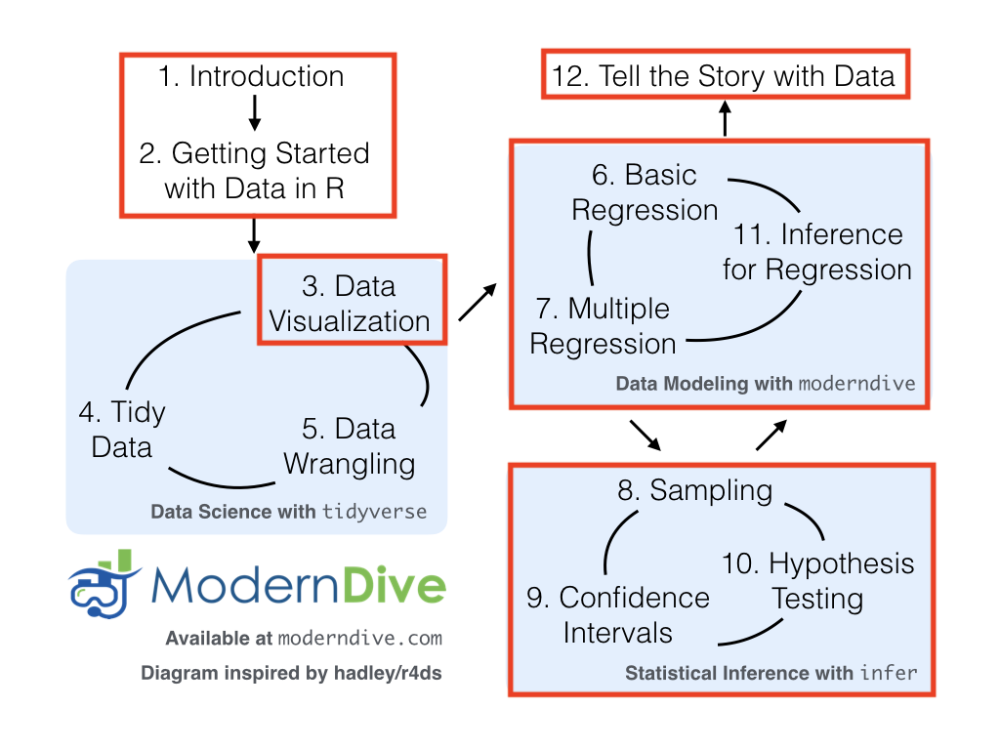

```{r, echo=FALSE, message=FALSE}
library(tidyverse)
library(knitr)
library(lubridate)
library(DiagrammeR)

start_date <- mdy("01-20-2020") + seq(0,7*15,7)
```


### Instructor  
**Lisa Lendway, PhD**  

**Office Hours: M 1:00-3:30PM, W 9:30AM-12:00PM OLRI 227** or by appointment. Office hours are a time for you to come in and ask questions about assignments or topics from class. I expect to have students in my office during the entire time, thus I do not do other work during those hours. I encourage you to stop in as soon as you have questions rather than waiting until you feel overwhelmed. I look forward to seeing you there!

**Email**: llendway@macalester.edu  
**Course materials**: [https://moodle.macalester.edu](https://moodle.macalester.edu)  
**Required Text**: [ModernDive](https://moderndive.com/) by Chester Ismay and Albert Y. Kim, a free textbook that is completely online. We will also use some [RStudio online tutorials](https://rstudio.cloud/learn/primers) during the first few weeks of the course. 

### Preceptors

Hassan Ismaeel, hismaeel@macalester.edu  
Yutong Wu, ywu1@macalester.edu


**Preceptor Office Hours (OLRI 254):**  See [moodle page](https://moodle.macalester.edu)

### Course Description  
An introductory statistics course with an emphasis on multivariate statistical modeling using R statistical software. Topics include data visualization, descriptive statistics, linear models/multiple regression, and logistic regression.  
This course is focused on building and interpreting statistical models and the computer code needed to do this. To that end, you should plan to have your computers with you in class or to use the computers in the classroom. A portion of class time will be spent doing activities on the computer, some of which will be turned is as part of weekly homework assignments. During class time, please refrain from doing activities on your computers that are outside of class content. 

```{r, echo=FALSE, message=FALSE, fig.align='center', include=FALSE}
DiagrammeR::grViz("digraph {

graph [layout = dot]

# define the global styles of the nodes. We can override these in box if we wish
node [shape = rectangle, style = filled, fillcolor = lightblue]

explore [label = '1. Explore the data with visualizations and numerical summaries
']
model [label = '2. Model relationships among variables using regression (mostly linear models) and interpret results
']
infer [label= '3. Make inferences from the model based on a sample of data to the population of interest
']

# edge definitions with the node IDs
explore  -> model -> infer
}")
```

This figure from the Modern Dive textbook gives a basic outline of how we will progress through the course and how all these concepts are connected.

 

### Software
We will use R and the R Studio IDE regularly, starting on the first day.  You should download the software locally to your computer. First, download R from [CRAN](https://cran.r-project.org/) (Comprehensive R Archive Network). Then download [RStudio](https://www.rstudio.com/products/rstudio/), the desktop version. See the R Basics file on moodle for more detailed information. IMPORTANT: If you have used R in the past, re-install R and RStudio! For Mac users, after you install R Studio, be sure to drop it in the Applications folder. R Studio is an IDE (integrated development environment) for R. It gives you a nice way to interface with the R Software. (Fun fact, R Studio was founded by [J.J. Allaire](https://en.wikipedia.org/wiki/Joseph_J._Allaire), a graduate of Macalester College!) 

All students also have access to the software via Macalester's server. You can sign in using your Macalester ID and password at [https://rstudio.macalester.edu](https://rstudio.macalester.edu). There are some benefits to using the server version, although I will focus on the desktop version in class.

### Learning Goals  
By the end of this course, students should be able to:  

* Read data into R and graphically explore it to learn about relationships among variables.  
* Fit linear and logistic models to data using more than one explanatory variable.  
* Correctly interpret coefficients from linear and logistic regression models and use the model for prediction.  
*	Assess the quality of statistical analyses that are reported in common news outlets and ask questions about details of the analysis or what next steps should be taken.  
* Apply inferential techniques and know their limitations.   
* Use data and statistics to address realistic questions in their area of interest.
* Produce a high-quality html document that includes R code, R output, and text.
* Work in a group of peers on a project or assignment, dividing the work equitably. 

### Student expectations
I expect you to come to class prepared by doing reading and other assigned activities in a timely manner, to give your full attention to the classroom, to respect one another and me, to listen to each others' questions and ideas, to maintain academic integrity, to give me feedback on all aspects of the course, to ask hard questions (and easy ones), to answer each others' questions, and to find applications of what you learn in this class outside of our classroom.

### What you should expect of me    
I believe statistics can be a powerful tool and one that everyone can benefit from, no matter what you do in the future. I hope you feel the same way after taking this course. As a professor, I promise to be passionate about the course, to provide materials in a timely manner, to listen to your questions and feedback, and to take all your questions seriously. I will hold regular office hours and be open to appointments outside of those hours. I will respond to emails from 8AM-5PM M-F and will do my best to respond within 3 hours.  

### Course environment  
**Academic Integrity:** Students are expected to maintain the highest standards of honesty in their college work; violations of academic integrity are serious offenses. Students found guilty of any form of academic dishonesty -- including, for instance, forgery, cheating, and plagiarism -- are subject to disciplinary action. Examples of behavior that violates this policy, as well as the process and sanctions involved, can be found on the [Academic Programs website](http://www.macalester.edu/academicprograms/academicpolicies/academicintegrity/).  
**Accessibility:** I am committed to ensuring access to course content for students.  Reasonable accommodations are available for students with documented disabilities.  Contact the Disability Services Office, 651-696-6874 to schedule an appointment and discuss your individual circumstances.  It is important to meet as early in the semester as possible; this will ensure that your accommodations can be implemented early on. The Director of Disability Services coordinates services for students seeking accommodations.  
**Diversity:** At Macalester, we embrace diversity of age, background, beliefs, ethnicity, gender, gender identity, gender expression, national origin, religious affiliation, sexual orientation, and other visible and non-visible categories. I do not tolerate discrimination. We are all here because we deserve to be here.  
**Names/pronouns:** You deserve to be addressed in the manner you prefer. To guarantee that I address you properly, you are welcome to tell me your pronoun(s) and/or preferred name at any time, either in person or via email.  
**Health and well-being:** (This statement was created by the folks at the Laurie Hamre Center for Health and Wellness and I fully endorse it.) Here at Macalester, you are encouraged to make your well-being a priority throughout this semester and your career here. Investing time into taking care of yourself will help you engage more fully in your academic experience. Remember that beyond being a student, you are a human being carrying your own experiences, thoughts, emotions, and identities with you. It is important to acknowledge any stressors you may be facing, which can be mental, emotional, physical, financial, etc., and how they can have an academic impact. I encourage you to remember that you have a body with needs. In the classroom, eat when you are hungry, drink water, use the restroom, and step out if you are upset and need a break. Please do what is necessary so long as it does not impede your or others’ ability to be mentally and emotionally present in the course. Outside of the classroom, sleep, moving your body, and connecting with others can be strategies to help you be resilient at Macalester. If you are having difficulties maintaining your well-being, please don’t hesitate to contact me and/or find support from other [resources](http://bit.ly/30nB22k).


### Evaluation  
**Midterm exam** (20%) This will be in-class and you will be able to use your book, notes, and your computer. You will submit a knitted html file to moodle, just like you do for homework.  
**Final Exam** (20%)  Same as the midterm, likely on the last day of the class.  
**Project** (15%) Work in groups of 2-3 students doing a complete analysis of a dataset of your choosing (I will give suggestions). More details will be provided later. NOTE: you will present final projects during your final exam time, Saturday, May 9 1:30-3:30PM.  
**Homework & in-class labs/assignments** (40%) These assignments need to be written up in R Markdown and knitted to an html document. The html document (NOT the R Markdown document) is submitted on moodle. You are welcome to collaborate with other students on all assignments. Most weeks each student must turn in their own assignment, written in their own words, but there will be a few opportunities to turn in assignments as a group. Homework will always be due on Tuesday evenings at 11:59PM. New homework assignments will be posted by the Thursday prior to its due date. They will made up of a combination of work you start (and may finish) in class and additional problems. We will always use real data and as often as possible will make it current and relevant. *In general, no late homework will be accepted!* So, please be mindful of the due date and give yourself enough time to have the document complete in its final form before then. Your lowest homework grade will be dropped.  
**Reflections** (5%) You will submit a short reflection at the end of most class periods to ask questions about what was covered in class and in recent readings. They are 2 points each and I will drop your 3 lowest scores.  

### Grade Distribution:
A:>93%, A-:90-93%, B+:86.7-90%, B:83.3=86.7%, B-:80-83.3%, C+:76.7-80%, C:73.3-76.6%, C-:70-73.3%, D+:65-70%, D:60-65%


### Tentative Schedule
```{r, results='asis', echo=FALSE}
tibble(Week=1:16, 
       `Start date` = start_date,
       Subject=c("R Intro, Data Vis/Summaries","Data Vis/Summaries", "Linear models with one variable", "Linear models with >1 variable", 
                 "Linear models with interactions", "Transforming variables/Evaluating Models", "Logistic models", 
                 "Logistic models", "","Sampling variability", "Inference - confidence intervals",
                 "Inference - confidence intervals","Inference - hypothesis tests", "Inference - hypothesis tests", "", ""),
       Notes=c("","", "", "", "", "Capstone Days!", "", "Midterm Exam", "Spring Break",
               "","", "","", "", "Final Exam on last day of class, 4/30", "Project presentations 5/9")) %>% 
  kable(align = c("c","c","c","c"))
```
