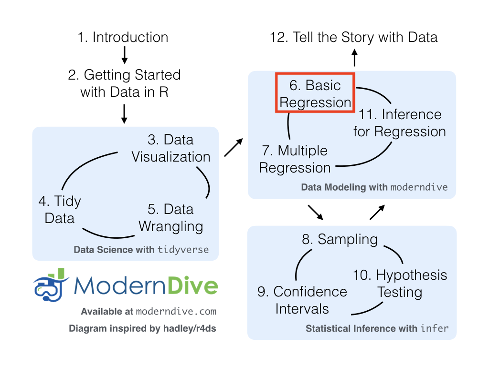

```{r, message=FALSE, warning=FALSE}
library(tidyverse)      # for plotting and summarizing
library(moderndive)     # for nice model output
library(broom)          # for nice model output 
library(equatiomatic)   # for writing model equations
theme_set(theme_minimal()) # changes the theme of ggplots to theme_minimal, my personal favorite
```


{width=600px}

As we begin to study models, remember this quote by famous statistician George Box, 
\
\

<center>
**"All models are wrong but some are useful."**
</center>
\
\


<div class="alert alert-success">
  <strong>GOAL:</strong>

By the end of these notes and activities, you should be able to perform the following tasks.

* Fit a linear regression model using the `lm` function.  
* Write out a model equation by hand.  
* Obtain model output using `tidy()` or `get_regression_table()`.  
* Interpret the coefficients from a simple linear regression model that uses one quantitative OR one categorical predictor variable.  
* Use the `augment()` function (or `get_regression_points()`) to obtain fitted values and residuals.  
* Use the `augment()` function to predict new values.  
* Plot the fitted line on top of the observed values.

</div>


# The data

We will use the `mpg` dataset from the `ggplot2` library (part of the `tidyverse`). This is a subset of the `vehicles` dataset we have been examining. It has been further cleaned. To learn more about the dataset, search for `mpg` in the Help tab or run `?mpg` in the console.

<div class="alert alert-info">
  <strong>YOUR TURN!</strong>

1. How would you describe the relationship between *displ* and *hwy*?  
2. Is the description different for each *drv*?

```{r}
mpg %>% 
  ggplot() +
  geom_jitter(aes(x=displ, y=hwy, color=drv))
```

3. Create some graphs and calculate statistics to describe the distribution of each of the three variables we're studying. Write down a description in 1-2 sentences for each.

```{r}
```

</div>

# Introduction

We are going to discuss different types of linear models, their notation in R, how to interpret the model coefficients, and how to use them for prediction.

What does it mean to fit a model to data? We are looking for a mathematical equation to represent the "general" relationship between a *response variable* and *explanatory variables*. We know it won't be perfect, but we would like something useful. In this course, we focus on linear models. They take the form:

$$
\hat{y} = \hat{\beta}_0 + \hat{\beta}_1 x_1 + \hat{\beta}_2 x_2 + ... + \hat{\beta}_p x_p.
$$

The "hats" on top of the $y$ and the $\beta$s are to indicate that those quantities are estimates obtained from data. The $\beta$s will be numbers. The above is just a more complex version of the traditional equation of a line:

$$
y = mx + b
$$

The resulting model equation has many different names: model equation (or specifically linear model equation or just model), fitted model, least squares regression line, multiple regression line, estimated line, etc. These all mean the same thing.

The model has two main uses:

1. Explanation: to explain the relationship between the explanatory variables and the response variable, ie. how $y$ relates to each of $x_1$, $x_2$, ...,$x_p$. The coefficients ($\hat{\beta}_1$, $\hat{\beta}_2$, ..., $\hat{\beta}_p$) tell us about that. 

2. Prediction: to find the *predicted value* (also called *predicted response*, *fitted value*, *model value*, and a few other things) which is the value the response variable takes when you plug in the values of the explanatory variables. Or to predict values of $y$ when it is unknown.

We will use the `lm` function (which stands for linear model) to fit models. This function requires two arguments: the model equation and the data. The model equation is written in the form `y ~ x1 + x2`, where `y` is the response and `x1` and `x2` are the explanatory variables. More variables can be added by using the `+` sign to separate them. Here is a generic example

```{r, eval=FALSE}
lm(y ~ x1 + x2, data=the_data)
```

# Linear regression with one quantitative explanatory variable

Let's look at an example.

```{r}
lm_displ <- lm(hwy ~ displ, data=mpg)

lm_displ
```

Notice a couple things:

1. I have saved this model to an object named `lm_displ`.  
2. The output gives us the intercept, $\hat{\beta}_0$ and the slope  or coefficient for the `displ` term, $\hat{\beta}_1$.


We can obtain more output (which we'll want when we start doing inference), using the either the `get_regression_table()` or `tidy()` function.

```{r}
get_regression_table(lm_displ)
```


```{r}
tidy(lm_displ)
```

For now, we are just interested in the *term* and *estimate* columns. The *term* column is the term/variable in the model equation. The column titled *estimate* gives the estimated coefficients of the variables/terms (ie. the $\hat{\beta}$s. 

We could write out the equation above as:

$$
\hat{hwy} = 35.70 - 3.53 displ
$$

There's even a function that will write out the model equation for us!

```{r}
extract_eq(lm_displ, 
           wrap = TRUE, 
           use_coefs = TRUE,
           ital_vars = TRUE)
```


## Explanation

<div class="alert alert-info">
  <strong>YOUR TURN! (don't look ahead)</strong>

1. How do you interpret the intercept, 35.70?  
2. How do you interpret the slope, -3.53?

</div>


\
\
\
\
\
\
\
\
\
\
\
\
\
\
\
\
\

In general, in a simple linear regression with one quantitative explanatory variable, the intercept is the *average* response when the explanatory variable(s) is equal to zero. The slope is the *average* change in the response variable for a one unit increase in the explanatory variable. The image below helps illustrate this (don't worry about the code).

```{r, echo=FALSE}
ggplot(mpg,
       aes(x = displ, y = hwy)) + 
  geom_jitter() +
  geom_smooth(method = "lm", se = FALSE) +
  geom_vline(xintercept = 4, color = "lightgoldenrod", alpha = .5, size = 2) +
  geom_vline(xintercept = 3, color = "mediumpurple1", alpha = .5, size = 2) +
  geom_hline(yintercept = 35.70 - 3.53*3, color = "mediumpurple1", alpha = .5, size = 2) +
  geom_hline(yintercept = 35.70 - 3.53*4, color = "lightgoldenrod", alpha = .5, size = 2) +
  scale_x_continuous(breaks = 1:8) +
  scale_y_continuous(breaks = seq(10,60,10)) +
  labs(title = "Raw data with model (blue line)")
```

The blue line shows the fitted line (the model). The purple vertical line highlights engine displacement values of 3 cubic inches. The purple horizontal line reflects the fitted value, $\hat{y}_i$ for an observation with a displacement of 3. The yellow vertical line highlights engine displacement values of 4 cubic inches. The yellow horizontal line reflects the fitted value, $\hat{y}_i$ for an observation with a displacement of 4. The distance between the purple and yellow lines is about - 3.53, which reflects the estimated slope. On average, cars with a displacement that is 1 cubic inch larger will get 3.53 MPG less. The intercept, 35.70, is interpreted as the average MPG for a car with a displacement of 0 cubic inches.


## Prediction

In addition to interpreting the models, we often want to use them to predict future or unknown values of the response variable for observations where we know the values of the explanatory variables. We will introduce and reiterate some terms.

* **actual values**, also called observed values, are exactly what you might guess, the actual values of the response variable. They are the $y_i$'s.
* **fitted values**, also called predicted values or model values, are the value the response variable takes when you plug in the values of the explanatory variables. They are the $\hat{y}_i$'s.  
* **residuals** are the difference between the actual and fitted values, $y_i - \hat{y}_i$'s. 

```{r, echo=FALSE}
augment(lm_displ, data = mpg) %>% 
  ggplot(aes(x = displ, y = hwy)) +
  geom_point(alpha=.3) + 
  geom_line(aes(x = displ, y = .fitted), color = "blue", size = .5) +
  geom_point(aes(x = displ, y = .fitted), color = "blue") +
  geom_segment(aes(xend = displ, 
                   yend = 35.70 - 3.53*displ), 
               color = "darkred") +
  scale_x_continuous(breaks = 1:8) +
  scale_y_continuous(breaks = seq(10,60,10)) +
  labs(title = "Actual (black), Fitted (blue), and residuals (red)")
```

<div class="alert alert-info">
  <strong>YOUR TURN! (don't look ahead)</strong>

How would you find the predicted highway miles per gallon for a vehicle with an engine displacement of 4.5 litres?

</div>

\
\
\
\
\
\
\
\
\
\
\
\
\
\
\
\

We can use the `augment()` function to help us do this. The `get_regression_points()` function from the `moderndive` library also works. The names of the variables in the output are slightly different, though, and it will not work later when we do logistic regression.

We can use it to find the predicted responses for all the data used to fit this model. Below I just show the first 10 rows.

```{r}
aug_displ <- augment(lm_displ)

aug_displ %>% 
  slice(1:10)
```

This dataset contains the response variable, all explanatory variables, and some additional information. One piece of additional information is the variable *.fitted*. These are the predicted (fitted) values. 

Sometimes we want all the variables in our original dataset, plus these new variables. We can get that, by adding a `data = ` argument to the `augment()` function. 

```{r}
augment(lm_displ, data = mpg) %>% 
  slice(1:10)
```

We can also use `augment() ` to predict unknown or future values, like predicting the highway MPG for a displacement of 4.5. We need to add a `newdata = ` argument to the function and give it a dataset as an argument. Because there is just one value, we can create the dataset "on the fly." The `tibble()` function can be used to create a dataset. If we wanted multiple predictions, we separate them with commas inside the `c()`. Be sure the variable is named EXACTLY as the variable name appears in the original dataset.

```{r}
augment(lm_displ, 
        newdata = tibble(displ = c(4.5)))

#example of more than one prediction
augment(lm_displ, 
        newdata = tibble(displ = c(3, 3.5, 4.0, 4.5, 5.0, 5.5)))

#OR

my_new_data <- tibble(displ = c(3, 3.5, 4.0, 4.5, 5.0, 5.5),
                      garbage = c(1,2,3,4,5,6))

augment(lm_displ, 
        newdata = my_new_data)

```

We can also use this to plot our fitted line on the plot of the original data.

```{r}
augment(lm_displ, data = mpg) %>% 
  ggplot() +
  geom_jitter(aes(x = displ, y = hwy)) + 
  geom_line(aes(x = displ, y = .fitted), color = "blue") + #the fitted line
  labs(x = "Engine Displacement", y = "Highway MPG")
```

<div class="alert alert-info">
  <strong>YOUR TURN!</strong>

1. Fit a model that used *cty* to explain *hwy*. Write down the model equation.  
2. Interpret the intercept and slope from the model.  
3. Plot the line on top of a scatterplot of the data.  
4. Use the model to predict the highway MPG, *hwy*,  for a car that gets 24 MPG in the city and for a car that gets 65 MPG in the city. Do you trust both of these predictions?

</div>

# Linear regression with one categorical (factor) variable

Now, let's examine a model that uses a categorical (factor) explanatory variable. First, we'll try just putting a categorical variable in the model equation.

```{r}
lm_drv <- lm(hwy ~ drv,
                 data=mpg)
tidy(lm_drv)
```

It did something. **WHAT did it do? Any ideas?** First, let's run the following code. **How is what we see below related to what we see above?**

```{r}
mpg %>% 
  group_by(drv) %>% 
  summarize(mean_hwy = mean(hwy))
```

Since R cannot use *drv* directly (its values are words not numbers), it is creating 2 new variables: 

*drvf* is 1 if *drv* is *f* and 0 otherwise, and 
*drvr*  is 1 if *drv* is *r* and 0 otherwise.  

Let's write out the model equation:

$$
\hat{hwy} = 19.18 + 8.99drvf + 1.83drvr
$$

Or, we can write code that writes the equation for us:

```{r}
extract_eq(lm_drv, 
           wrap = TRUE, 
           use_coefs = TRUE,
           ital_vars = TRUE)
```

<div class="alert alert-info">
  <strong>YOUR TURN! (don't look ahead)</strong>

1. When will both *drvf* and *drvr* take a value of 0?  
2. What is the predicted value for a front wheel drive vehicle?  
3. What is the predicted value for a rear wheel drive vehicle?
4. What is the predicted value for a 4 wheel drive vehicle? 
5. Interpret each of the coefficients.

</div>

\
\
\
\
\
\
\
\
\
\
\
\
\
\
\
\

In general, in a simple linear regression with one categorical explanatory variable, the intercept is the *average* response when the explanatory variable is at the "baseline" or "reference" level. That is the level of the categorical variable that does not have a dummy variable created for it. Notice, that is also the average response when all other variables are zero, same as when we had one quantitative explanatory variable. 

The other coefficients are the difference in average response between the level of the indicator variable and the reference level. This is similar to "increasing the explanatory variable by one," but it doesn't really make sense to talk about it that way.

<div class="alert alert-info">
  <strong>YOUR TURN!</strong>

1. Create a model that uses *class* to explain *hwy*. Interpret each of the coefficients.  
2. What is the predicted highway MPG for a pickup?

</div>


# Intercept Only Model

A *very* simple model we thus far have avoided considering, is one with only an intercept. We can fit that model using the code below. 

```{r}
lm_int <- lm(hwy ~ 1, data=mpg)
```

<div class="alert alert-info">
  <strong>YOUR TURN!</strong>
  
1. How would you interpret the estimated intercept?  
2. What does this model mean conceptually? When would this be a "good" model?

</div>


