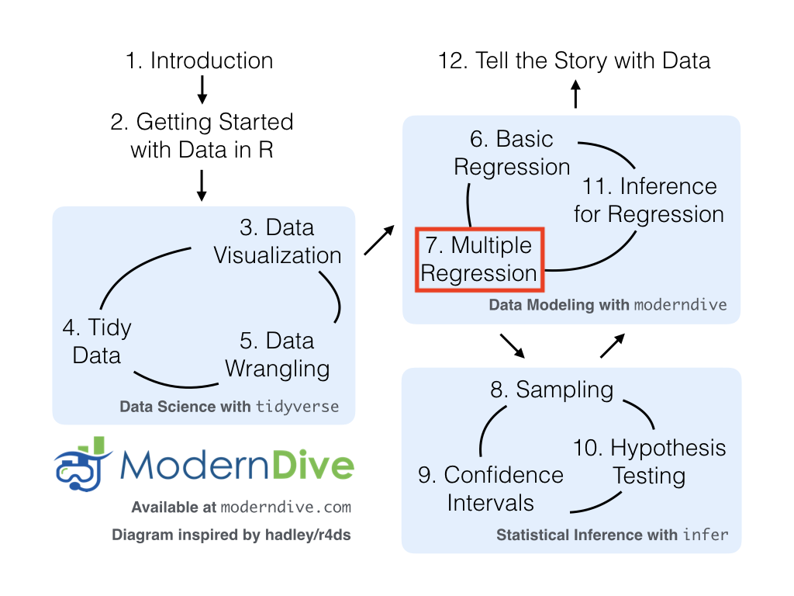

```{r, message=FALSE, warning=FALSE}
library(tidyverse)      # for plotting and summarizing
library(moderndive)     # for nice model output
library(broom)          # for nice model output 
library(equatiomatic)   # for writing model equations
theme_set(theme_minimal()) #changes the theme of ggplots to theme_minimal, my personal favorite
```

{width=600px}

<div class="alert alert-success">
  <strong>GOAL:</strong>

By the end of these notes and activities, you should be able to perform the following tasks.

* Fit a multiple regression model using `lm()` and obtain model output using `tidy()`.  
* Interpret the coefficients from a multiple linear regression model that uses both quantitative and categorical predictor variables.  
* Use the `augment()` function to predict the response on new data.  
* Plot the fitted line on top of the observed values, when possible.

</div>

# Review

## One quantitative variable 

Interpret the estimated coefficients.

```{r}
lm_displ <- lm(hwy ~ displ,
                     data=mpg)
tidy(lm_displ)
```

Predict new value:

```{r}
augment(lm_displ, newdata = tibble(displ = 5))
```


Plotting the model:

```{r}
augment(lm_displ, data=mpg) %>% 
  ggplot() +
  geom_jitter(aes(x=displ, y=hwy, color=drv)) +
  geom_line(aes(x=displ, y=.fitted))
```

## One categorical variable

Interpret the estimated coefficients.

```{r}
lm_drv <- lm(hwy ~ drv,
                 data=mpg)
tidy(lm_drv)
```

Predict new value:

```{r}
augment(lm_drv, newdata = tibble(drv = "4"))
```

Plotting the model:

```{r}
augment(lm_drv, data=mpg) %>% 
  ggplot() +
  geom_jitter(aes(x=displ, y=hwy, color=drv)) +
  geom_line(aes(x=displ, y=.fitted, color=drv))
```

We could also just do this plot. I plotted it as above because we will eventually be interested in using both variables, *displ* and *drv*, to predict *hwy*.

```{r}
augment(lm_drv, data=mpg) %>% 
  ggplot() +
  geom_jitter(aes(x=drv, y=hwy), width = .1) +
  geom_point(aes(x=drv, y=.fitted), color="red")
```


# More than one variable

Next, we would like to use both *drv* and *displ* to explain *hwy*. 

```{r}
lm_twovars <- lm(hwy ~ drv + displ,
                 data=mpg)
tidy(lm_twovars)
```

<div class="alert alert-info">
  <strong>YOUR TURN!</strong>

1. Write out the model equation using the form below. You can use the `extract_eq()` function to do this.

$$
\hat{y} = \hat{\beta}_0 + \hat{\beta}_1 x_1 + \hat{\beta}_2 x_2 + ... + \hat{\beta}_p x_p.
$$

2. Are the coefficients the same as they were in the model with only *drv*?  Or with only *displ*? Why?  
3. Interpret each of the coefficients. It might be helpful to write the model equation for each of the three drives. That is, if you plug in `drv = 4`, you will end up with an equation that describes the relationship between `displ` and `hwy`. You can do the same for `drv = f` and `drv = r`. 
4. Plot this model. You will need to color by `drv`. There is something special about it ... what?  
5. Use the model to predict `hwy` mpg for a 4 wheel drive car with a displacement of 5 and a front wheel drive car with a displacement of 2.5.

</div>

\
\
\
\
\
\
\
\
\

In a model with more than one variable, we are determining the affect of each variable, while accounting for all other variables in the model. This affect might change after accounting for those other variables. Let's examine this visually first with this toy example (don't worry about the code).

```{r, echo=FALSE}
set.seed(10)

x1 <- runif(n = 10, min = 0, max = 10)
y1 <- 5 + rnorm(n = 10, mean = 0, sd = 2)

x2 <- runif(n = 10, min = 10, max = 20)
y2 <- 15 + rnorm(n = 10, mean = 0, sd = 2)

x3 <- runif(n = 10, min = 20, max = 30)
y3 <- 25 + rnorm(n = 10, mean = 0, sd = 2)

test_data <- tibble(x = c(x1, x2, x3),
                    y = c(y1, y2, y3),
                    grp = c(rep("a", 10), rep("b", 10), rep("c", 10)))

ggplot(test_data) +
  geom_point(aes(x = x, y = y, color = grp)) +
  theme_minimal()
```


The relationship between *x* and *y* within each *grp* is different than the overall relationship. What might you expect the coefficient of the *x* term to be in a linear regression that includes both *x* and *grp* to model *y*? What if we only include *x*?

\
\

## General Interpretation

In general, in a multiple linear regression model, the intercept is the *average* response when the explanatory variables are all equal to zero. If there are categorical variables in the model, the intercept then reflects the average response when the categorical variable(s) are at the baseline/reference level. 

Coefficients of quantitative explanatory variables are the *average* change in the response variable for a one unit increase in the explanatory variable, with all other variables held fixed (this indicates that we've accounted for those variables being in the model).

Coefficients of categorical explanatory variables are the difference in average response between the level of the indicator variable and the reference level, holding all other variables constant. 


# Interactions


We could also use these same variables and add an additional term called an *interaction term*. We keep each of the "main" terms of *displ* and *drv* (these are called *main effects*) but also "multiply" the two together, written as `drv:displ` in the R code. Let's examine how to do this in R and what it means for our interpretations. 

Rather than writing `lm(hwy ~ drv + displ + drv:displ, data=mpg)`, we can write this shortcut.

```{r}
lm_interaction <- lm(hwy ~ drv*displ, 
                     data=mpg)
tidy(lm_interaction)
```


<div class="alert alert-info">
  <strong>YOUR TURN! (Don't look ahead)</strong>

1. Write out the model equation using the form below. You can use the `extract_eq()` function to do this.

$$
\hat{y} = \hat{\beta}_0 + \hat{\beta}_1 x_1 + \hat{\beta}_2 x_2 + ... + \hat{\beta}_p x_p.
$$

2. Interpret each of the coefficients in the model above. Be careful and precise in how you do this. Once again, it might be helpful to write the model equation for each of the three drives. That is, if you plug in `drv = 4`, you will end up with an equation that describes the relationship between `displ` and `hwy`. You can do the same for `drv = f` and `drv = r`. 
3. What does adding an interaction term do? When would you add an interaction term?  
4. Plot this model. You will need to color by `drv`.  
5. Use the model to predict `hwy` mpg for a 4 wheel drive car with a displacement of 5 and a front wheel drive car with a displacement of 2.5.

</div>


\
\
\
\
\
\
\
\
\
\
\
\
\
\
\
\
\
\
\
\
\
\
\
\
\

## General Interpretation

Interaction effects allow one explanatory variable to modify how another explanatory variable effects the response variable. In the example above, we saw that the effect of `displ` changed depending on the `drv` (it is also true that the effect of `drv` changes depending on `displ`). Be careful in your interpretation as this **DOES NOT** mean that the two explanatory variables involved in the interaction effect are or need to be highly correlated. 

The coefficients of interaction terms that involve a quantitative and categorical variable represent a change in the slope of the line in the model where the quantitative predictor is used to model the response between the level of the indicator variable and the reference level. 

In the example above, the coefficient for the `drvr:displ` term means that the slope of the line that uses `displ` to model `hwy` is 1.96 greater for rear wheel drive cars than 4 wheel drive cars. We could also say that the amount by which hwy mpg increases for a 1 unit increase in displacement is 1.96 MPG greater for rear wheel drive cars than 4 wheel drive cars.

The coefficients of the main effect terms have to be interpreted very carefully since those variables are also involved in the interaction terms. They often will be about the reference level or when the quantitative variable takes a value of 0. We are usually most interested in the coefficients of the interaction term.

# Other models

Above, we had one categorical variable and one quantitative variable. We can fit models with only categorical or only quantitative or with MANY, MANY more variables and terms. Interpretations will stay more or less the same. The most important part to remember, is that whenever you are interpreting a coefficient, you must acknowledge the other variables that have been included in the model. 


