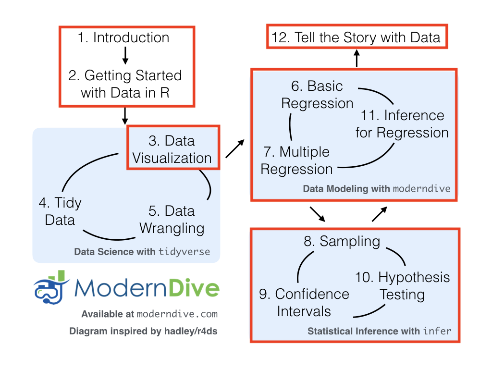

```{r, echo=FALSE, message=FALSE}
library(tidyverse)
library(knitr)
library(lubridate)
library(DiagrammeR)

start_date <- mdy("08-30-2020") + seq(0,7*15,7)
```


### Instructor 

**Lisa Lendway, PhD**  

**Office Hours: M 9:30-11:30AM, W 1:00-3:00PM OLRI 227** or by appointment. 

Office hours are a time for you to come in and ask questions about assignments or topics from class. I expect to have students in my office during the entire time, thus I do not do other work during those hours. I encourage you to stop in as soon as you have questions rather than waiting until you feel overwhelmed. I look forward to seeing you there!

**Email**: llendway@macalester.edu  

### Preceptors

See [moodle page](https://moodle.macalester.edu) for their contact information and office hours.

The preceptors are an essential part of this course. They hold their own office hours, grade most of the homework assignments, and might help out in class occasionally.  I encourage you to get to know them and go to their office hours. Please see me with questions about grading.

### Course Description  

An introductory statistics course with an emphasis on multivariate statistical modeling using R statistical software. Topics include data visualization, descriptive statistics, linear models/multiple regression, and logistic regression.  
This course is focused on building and interpreting statistical models and the computer code needed to do this. To that end, you should plan to have your computers with you in class or to use the computers in the classroom. A portion of class time will be spent doing activities on the computer, some of which will be turned is as part of weekly homework assignments. During class time, please refrain from doing activities on your computers that are outside of class content. 

```{r, echo=FALSE, message=FALSE, fig.align='center', include=FALSE}
DiagrammeR::grViz("digraph {

graph [layout = dot]

# define the global styles of the nodes. We can override these in box if we wish
node [shape = rectangle, style = filled, fillcolor = lightblue]

explore [label = '1. Explore the data with visualizations and numerical summaries
']
model [label = '2. Model relationships among variables using regression (mostly linear models) and interpret results
']
infer [label= '3. Make inferences from the model based on a sample of data to the population of interest
']

# edge definitions with the node IDs
explore  -> model -> infer
}")
```

This figure from the Modern Dive textbook gives a basic outline of how we will progress through the course and how all these concepts are connected. In this class, we don't do a lot of tidying and wrangling. Those are great skills to have, though, and I'd recommend taking Intro to Data Science where you concentrate on them much more.

 


### Required Materials

* [ModernDive](https://moderndive.com/) by Chester Ismay and Albert Y. Kim, a free textbook that is completely online.  
* [RStudio online tutorials](https://rstudio.cloud/learn/primers)  
* [In-class lessons](https://stat155.netlify.app/)  
* Software: R and RStudio (Fun fact, R Studio was founded by [J.J. Allaire](https://en.wikipedia.org/wiki/Joseph_J._Allaire), a graduate of Macalester College!). Details for how to install them can be found in the [R Basics document](https://r-basics.netlify.app/). IMPORTANT: If you have used R in the past, re-install R and RStudio! All students also have access to the software via Macalester's server. You can sign in using your Macalester ID and password at [https://rstudio.macalester.edu](https://rstudio.macalester.edu). There are some benefits to using the server version, although I will focus on the desktop version in class.

### Learning Goals  

By the end of this course, students should be able to:  

* Read data into R and graphically explore it to learn about relationships among variables.  
* Fit linear and logistic models to data using more than one explanatory variable.  
* Correctly interpret coefficients from linear and logistic regression models.  
* Use linear and logistic regression models for prediction.  
*	Assess the quality of statistical analyses that are reported in common news outlets and ask questions about details of the analysis or what next steps should be taken.  
* Evaluate the statistical analysis from an ethical perspective, specifically ask questions about how the data were collected and investigate and report on any issues.  
* Apply inferential techniques and know their limitations.   
* Use data and statistics to address realistic questions in their area of interest.
* Produce a high-quality html document that includes R code, R output, and text.
* Work in a group of peers on a project or assignment, dividing the work equitably. 

### How to be successful in this class

* Do the required reading and other pre-class work.  

* Read through the in-class lesson before class. You don't have to do the "Your Turn!" parts. This will help familiarize you with the code so you are more prepared to use it in class.  

* Come to class with your laptop so you can fully participate in the in-class activities. 

* Ask questions when you have them, even if you think they are silly. It is extremely likely that another student has the same question.

* Collaborate with others. I encourage you to work together on assignments, both in and out of class..  

* Ask for help when you need it. Your classmates, the preceptors, and I are great resources.

### How I will help you be successful    

I will:

* be passionate about the course

* provide materials in a timely manner

* listen to your questions and feedback, and take them seriously

* be respectful

* hold regular office hours and be open to appointments outside of those hours

* respond to emails from 8AM-4PM M-F and do my best to respond within 3 hours.  


### Course environment  

  **Studying during a pandemic**: Although the pandemic situation has gotten slightly better here in Minnesota, we still haven't returned to "normal". So, I still find this relevant.
  
  I can't find words to say this any better than my Twitter friend (I think that's a thing?), Andrew Heiss. So, I will just quote him.
  
  "Life absolutely sucks right now. None of us is really okay. We’re all just pretending.

You most likely know people who have lost their jobs, have tested positive for COVID-19, have been hospitalized, or perhaps have even died. You all have increased (or possibly decreased) work responsibilities and increased family care responsibilities—you might be caring for extra people (young and/or old!) right now, and you are likely facing uncertain job prospects (or have been laid off!).

I’m fully committed to making sure that you learn everything you were hoping to learn from this class! I will make whatever accommodations I can to help you finish your exercises, do well on your projects, and learn and understand the class material. Under ordinary conditions, I am flexible and lenient with grading and course expectations when students face difficult challenges. Under pandemic conditions, that flexibility and leniency is intensified.

If you tell me you’re having trouble, I will not judge you or think less of you. I hope you’ll extend me the same grace.

You never owe me personal information about your health (mental or physical). You are always welcome to talk to me about things that you’re going through, though. If I can’t help you, I usually know somebody who can.

If you need extra help, or if you need more time with something, or if you feel like you’re behind or not understanding everything, do not suffer in silence! Talk to me! I will work with you. I promise."

  **Academic Integrity:** Students are expected to maintain the highest standards of honesty in their college work; violations of academic integrity are serious offenses. Students found guilty of any form of academic dishonesty -- including, for instance, forgery, cheating, and plagiarism -- are subject to disciplinary action. Examples of behavior that violates this policy, as well as the process and sanctions involved, can be found on the [Academic Programs website](http://www.macalester.edu/academicprograms/academicpolicies/academicintegrity/).  

  **Accessibility:** I am committed to ensuring access to course content for students.  Reasonable accommodations are available for students with documented disabilities.  Contact the Disability Services Office, 651-696-6874 to schedule an appointment and discuss your individual circumstances.  It is important to meet as early in the semester as possible; this will ensure that your accommodations can be implemented early on. The Director of Disability Services coordinates services for students seeking accommodations.  

  **Diversity:** At Macalester, we embrace diversity of age, background, beliefs, ethnicity, gender, gender identity, gender expression, national origin, religious affiliation, sexual orientation, and other visible and non-visible categories. I do not tolerate discrimination. We are all here because we deserve to be here.  

  **Names/pronouns:** You deserve to be addressed in the manner you prefer. To guarantee that I address you properly, you are welcome to tell me your pronoun(s) and/or preferred name at any time, either in person or via email.  

  **Health and well-being:** (This statement was created by the folks at the Laurie Hamre Center for Health and Wellness and I fully endorse it.) "Here at Macalester, you are encouraged to make your well-being a priority throughout this semester and your career here. Investing time into taking care of yourself will help you engage more fully in your academic experience. Remember that beyond being a student, you are a human being carrying your own experiences, thoughts, emotions, and identities with you. It is important to acknowledge any stressors you may be facing, which can be mental, emotional, physical, financial, etc., and how they can have an academic impact. I encourage you to remember that you have a body with needs. In the classroom, eat when you are hungry, drink water, use the restroom, and step out if you are upset and need a break. Please do what is necessary so long as it does not impede your or others’ ability to be mentally and emotionally present in the course. Outside of the classroom, sleep, moving your body, and connecting with others can be strategies to help you be resilient at Macalester. If you are having difficulties maintaining your well-being, please don’t hesitate to contact me and/or find support from other [resources](http://bit.ly/30nB22k)."


### Evaluation  

  **Homework & in-class labs/assignments** (50%) These assignments need to be written up in R Markdown and knitted to an html document. The html document (NOT the R Markdown document) is submitted on moodle. You are welcome to collaborate with other students on all assignments. Most weeks each student must turn in their own assignment, written in their own words, but there will be a few opportunities to turn in assignments as a group. Homework will always be due on Tuesday evenings at 11:59PM. New homework assignments will be posted by the Thursday prior to its due date. They will made up of a combination of work you start (and may finish) in class and additional problems. We will always use real data and as often as possible will make it current and relevant. Your lowest homework grade will be dropped.  
  
  **Project** (40%) Work in groups of 2-4 students doing a complete statistical analysis of a dataset. You will begin working on these near the beginning of the semester and will continue to build them up until the end. More details will be provided in a separate document. NOTE: you will present final projects during your final exam time.

  **Quizzes** (5%) There will be 6-7, short multiple choice Moodle quizzes each week that cover reading and other pre-class work. These should only take about 5 minutes to complete. *Your lowest quiz will be dropped.*
  
  **Reflections** (5%) You will submit a short reflection at the end of most class periods to ask questions about what was covered in class and in recent readings. They are 2 points each and I will drop your 3 lowest scores.  

### Grade Distribution:

I am moving towards "ungrading" but haven't fully arrived there yet. The table below indicates the minimum grade you will receive based on your percentage in the course. I will determine exact grades using both your percentage in the course and your feedback. There will be a few times during the course where you can weigh in and provide evidence about how you are doing in achieving the overall learning objectives for the course and for individual assignments. 

Course % | At least
---------|---------
90%      | A-
80%      | B-
70%      | C-
60%      | D


### Tentative Schedule
```{r, results='asis', echo=FALSE}
tibble(Week=1:16, 
       `Start date` = start_date,
       Subject=c("R Intro","Data Vis/Summaries", "Linear models with one variable", "Linear models with >1 variable", 
                 "Linear models with interactions", "Transforming variables/Evaluating Models", "Logistic models", 
                 "Logistic models", "Catch-up week","Sampling variation", "Sampling variation in models",
                 "Inference - confidence intervals","Inference - hypothesis tests", "Inference - hypothesis tests", "Projects", "Projects"),
       Notes=c("","", "", "", "", "", "", "Fall Break", "",
               "","", "","", "Thanksgiving Break", "", "Project presentations")) %>% 
  kable(align = c("c","c","c","c"))
```
